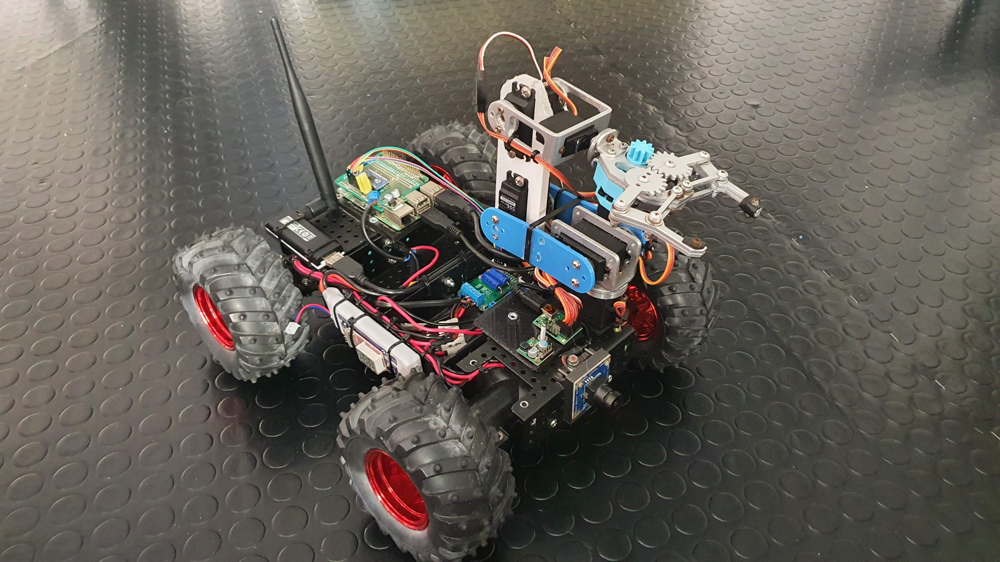

# Chrzaszcz Control Software


This is the repository holding the control code for the Chrzaszcz rover of the Analogue Astronaut Research Centre (AATC). It's a rather simple application, the intent of which is to provide the minimal functionality needed to keep the rover operational. 

This was originally developed by Mat Krainski, during the Alula simulation 7-13 May, 2022. It's intended to be extended by other analogue astronauts and independent contributors.

## The Rover


Some details of the rover construction are described in the Chrzaszcz Rover Flight Operations Manual available to AATC affiliates. If you'd like access or more detailed information, please reach out to me at mateusz@krainski.eu. It's nothing secret, honestly I just don't have a good and useful description prepared for persons who'd not have access to the actual rover.

## The software
The control software is a Flask application (`control-webservice.py`), which controls the rover based on REST requests it receives. The rover is set up to automatically start the webservice on boot. 

### Installation
This project is using `poerty` as dependency management. If you want to work on this code, you can install the dependencies with
``` bash
pip install poetry
poetry install
```

### Starting the development server
This application is designed to run in a single process and it doesn't need to handle high load. There should be only one operator using the rover at any time. Some quick tests have proven that using the Flask development server on the target system was sufficient to keep this running stabily. 

If you want to start this for development (on local, rather than on the rover), you can run:
``` bash
FLASK_APP=control-webservice ENV=development flask run
```
To run this on the rover, simply use `ENV=rover` instead. This environment variable controls loading Raspberry Pi specific libraries and starting the code with `ENV=rover` on local would just not work.

### Logic of the web application
The main part of the UI is the stream from the `motion` camera server that's running on the rover (it won't be running locally). Other than that there are no other UI elements visible. 

The web application is listening for key-down and key-up events and transforms them into periodic requests to the control webservice. I did it this way because listening for key input doesn't give satisfactory results. Usually, if you keep a key pressed, you will get one key press, around 1s pause, and then repeated key presses. That pause between the first registered press and the others is making driving a rover challenging. Listening to key-down and key-up events is much better because it allows for smooth operation. 

The application is sending the movement commands periodically for safety reasons. You can imagine that if the control would be that you just send a start and stop signal (and not repeated keep-moving signal), the rover could lose connection and would just keep moving. With the repeated movement commands, if the connection is lost, the rover will stop receiving movement commands and stop after a predefined timeout. Which is much better than the rover just driving off into the sunset.

### Logic of the control webservice
The webservice exposes a few endpoints which, when called properly, can move the rover. 

- `/` - returns the control application web application page
- `/control_rover_movement?left=0&right=0` - sets the rover motors to the values of `left` and `right` query parameters.
  - this command will start the rover to move for up to `CONTROL_TIMEOUT` seconds. If the movement command is not repeated within this interval, the rover will stop. Check out the section above for an explanation of this.
-  `/control_arm_movement?joint_0=0&joint_1=0&joint_2=0&joint_3=0&joint_4=0&joint_5=0` - controls the rover arm. Each of the joints is controlled individually, incrementally. `100` is a reasonable value to send here. E.g. sending `/control_arm_movement?joint_0=100` twice, will result in the arm base being moved by "200". I didn't have the time to investigate the units so these are what the `maestro` driver accepts. Total range of values sent to the arm, which result in correct arm movement are 3,000 - 9,000.
- `/reset_arm` - will move the arm to the base position.
- `/shutdown` - will shutdown the rover.

### Cleanup
If you wish to develop for this application, please adhere to the `black` code style. If you installed all the dependencies, you can set up githooks for this repository by running in the repository root:
```bash
python -m python_githooks
```
Now, on commit, a `cleanup.sh` script will be executed, which will automatically `black` all the modified Python files. You can also just apply `black` manually with `black .`.

## Why "Simple"?

This is not the first control software for the Chrzaszcz Rover I wrote. The previous version is at https://github.com/mt-krainski/chrzaszcz and https://github.com/mt-krainski/chrzaszcz_description. Over time, I deemed it the "complex" version as it's based on ROS, some pieces written in C++, some in Python, there are pieces using the Unified Robot Description Format (URDF), and all-in-all, even though principally it's a simple system, it required quite a lot of knowledge and skill to develop and operate. As cool as ROS is as a scientific and research tool (that version of the system also contained a simulator!), it's definitely not the best option for an "open" project. Not to mention that I was writing that a few years ago, there's pretty much no documentation, etc..

In this iteration, I decided to go for simplicity and maintainability and write a simple Python webservice to control the rover. That way it's easy to use from the operator perspective (i.e. just open a browser with the rover IP) and it's easy to maintain (i.e. it's just a Python Flask application). 
